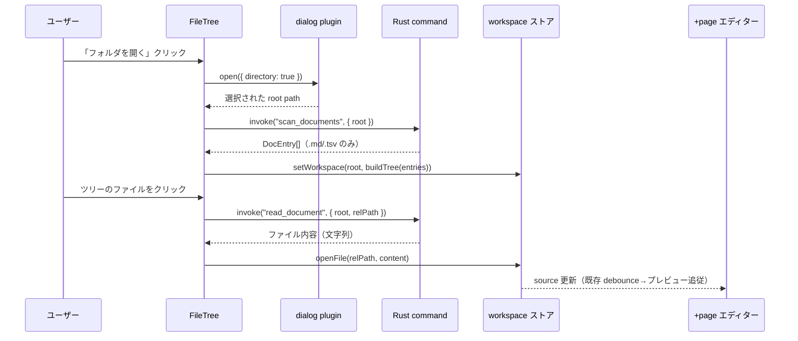
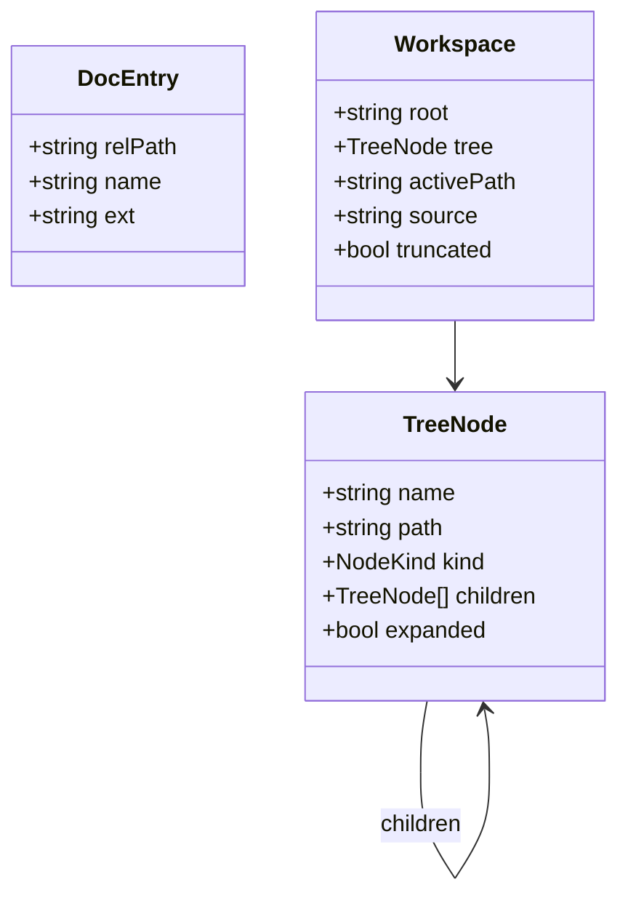
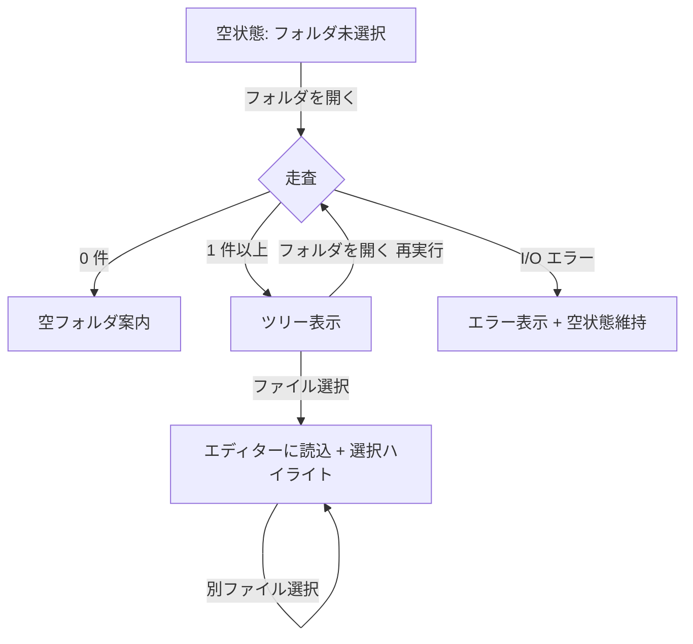

# 1. 概要

## 1.1 背景

Desktop アプリ（Tauri + SvelteKit）の左レール `FileTree.svelte` は Phase 1b 骨格として「フォルダを開くと文書ツリーが表示されます」の空状態＋ `disabled` ボタンのみを持ち、実ファイル走査・ツリー描画・選択が未接続である。中央エディター／プレビューは seed テンプレ（`apiSpecSample`）を開くだけで、ローカルの業務文書を開く導線が存在しない。本設計書はこの「フォルダを開く → 文書ツリー → クリックでエディターに読み込む」導線を定義する。

## 1.2 目的

- ユーザーがローカルフォルダを選択し、配下の md-business 文書（`.md` / `.tsv`）をツリー表示できるようにする
- ツリー上のファイルをクリックすると、中央エディターに内容を読み込み、既存のプレビュー／TSV グリッドがそのまま追従する
- Tauri バックエンド（Rust）とフロント（Svelte 5 runes）の責務境界を確定し、TDD 可能な純ロジックを分離する

## 1.3 スコープ

| スコープ | 含む / 含まない |
|---|---|
| フォルダ選択ダイアログ | 含む（`tauri-plugin-dialog`） |
| 配下の `.md` / `.tsv` 再帰走査 | 含む |
| 文書ツリー描画（フォルダ開閉・ファイル選択） | 含む |
| 選択ファイルをエディターへ読み込み | 含む |
| ファイル保存（書き戻し） | 含まない（別フェーズ・Phase 4 で扱う） |
| Git 連携・差分表示 | 含まない（後続フェーズ） |
| `.md` / `.tsv` 以外の拡張子表示 | 含まない（範囲は `.md` + `.tsv` に限定） |
| ファイル監視（外部変更の自動再読込） | 含まない（初期リリースは手動再オープン） |

## 1.4 用語

| 用語 | 定義 |
|---|---|
| ルート（root） | ユーザーが選択したフォルダの絶対パス |
| 文書エントリ（DocEntry） | 走査で得た 1 ファイルのメタ（相対パス・名前・拡張子） |
| ツリーノード（TreeNode） | 描画用の入れ子構造（フォルダ or ファイル） |
| ワークスペース（workspace） | ルート＋ツリー＋選択中ファイル＋読込済み source を束ねるフロント状態 |

# 2. システム構成

## 2.1 コンポーネント構成

フロント（+layout の `FileTree` と +page のエディター）は現在それぞれローカル状態を持つ。本機能では両者が共有する `workspace` rune ストアを新設し、Rust バックエンドの 3 コマンド（ダイアログ／走査／読込）を介してローカル FS に触れる。

```mermaid
graph LR
  FileTree[FileTree.svelte 左レール] -->|選択| Store[workspace rune ストア]
  Store -->|source| Page[+page.svelte エディター/プレビュー]
  FileTree -->|フォルダを開く| Dialog[tauri-plugin-dialog]
  Dialog -->|root path| Scan[invoke scan_documents]
  Scan -->|DocEntry[]| Store
  Store -->|選択 path| Read[invoke read_document]
  Read -->|文字列| Store
  Scan --> FS[(ローカル FS)]
  Read --> FS
```

## 2.2 フォルダを開くシーケンス



# 3. 機能仕様

## 3.1 機能一覧

| ID | 機能名 | 利用者 | 優先度 |
|---|---|---|---|
| F-001 | フォルダ選択 | ユーザー | 必須 |
| F-002 | `.md` / `.tsv` 再帰走査 | システム内部 | 必須 |
| F-003 | 文書ツリー描画（開閉・選択） | ユーザー | 必須 |
| F-004 | 選択ファイルのエディター読込 | ユーザー | 必須 |
| F-005 | 走査除外（隠しフォルダ・`node_modules` 等） | システム内部 | 必須 |
| F-006 | スキーマ別アイコン色 | ユーザー | 推奨 |
| F-007 | 選択状態のハイライト | ユーザー | 推奨 |

## 3.2 F-002 再帰走査

ルート配下を深さ優先で走査し、拡張子が `.md` または `.tsv` のファイルのみを `DocEntry` として収集する。**除外**：ドット始まりのディレクトリ（`.git` 等）、`node_modules`、`dist`、`build`。走査は Rust 側 `scan_documents` で行い、フロントには相対パスの配列（`DocEntry[]`）のみを返す（絶対パスはルート以外フロントに出さない）。深さ・件数の上限は初期リリースでは深さ 12・件数 5,000 を上限とし、超過時は打ち切って警告フラグを返す。

## 3.3 F-003 文書ツリー描画

`DocEntry[]`（フラットな相対パス配列）を純ロジック `buildTree` で入れ子の `TreeNode` に組み立てる。フォルダノードは開閉状態を持ち、既定は第 1 階層のみ開く。ファイルノードのクリックで F-004 を発火。同名フォルダ／ファイルはパスで一意。ソートは「フォルダ先行 → 名前昇順（`localeCompare`）」。

## 3.4 F-004 選択ファイルの読込

選択ノードの相対パスを Rust `read_document` に渡し、UTF-8 文字列を取得して workspace ストアの `source` に反映する。既存の +page.svelte は `source` をストア由来に切り替え、`debouncedSource`→プレビュー、`isTsvSource`→TSV グリッドの既存導線がそのまま機能する。読込失敗（削除済み・権限なし等）はツリー上にエラー表示し、エディターは前回内容を保持する。

# 4. データモデル

## 4.1 型定義（フロント）



## 4.2 Rust ⇄ フロント I/F（serde）

| コマンド | 入力 | 出力 |
|---|---|---|
| `scan_documents` | `{ root: string }` | `{ entries: DocEntry[], truncated: bool }` |
| `read_document` | `{ root: string, relPath: string }` | `string`（UTF-8 本文） |

`DocEntry` は `{ relPath: string, name: string, ext: string }`。`read_document` は `root` と `relPath` を結合・正規化し、**正規化後パスが root 配下であること**を検証してから読む（パストラバーサル防止・8.1）。

# 5. API 仕様（Tauri command）

## 5.1 コマンド一覧

| コマンド | 概要 | 権限 |
|---|---|---|
| （plugin）dialog.open | フォルダ選択ダイアログ | `dialog:allow-open` |
| scan_documents | ルート配下の md/tsv を走査 | 自作コマンド（capability 追加） |
| read_document | 単一ファイルを UTF-8 で読む | 自作コマンド（capability 追加） |

## 5.2 scan_documents

```rust
#[tauri::command]
fn scan_documents(root: String) -> Result<ScanResult, String>
```

`root` 配下を再帰走査し `.md` / `.tsv` のみ収集。除外ディレクトリ（`.` 始まり・`node_modules`・`dist`・`build`）はスキップ。深さ 12・件数 5,000 上限で打ち切り、`truncated=true` を返す。I/O エラーは `Err(String)`。

## 5.3 read_document

```rust
#[tauri::command]
fn read_document(root: String, rel_path: String) -> Result<String, String>
```

`root` と `rel_path` を結合し `canonicalize` 後に root 配下判定。範囲外・非 md/tsv は `Err`。UTF-8 として読み、不正バイトは `Err`。

# 6. 画面遷移

## 6.1 左レールの状態遷移



## 6.2 既定の展開

初回描画は第 1 階層フォルダのみ展開。ユーザーの開閉操作はセッション内で保持（初期リリースでは永続化しない）。

# 7. 非機能要件

## 7.1 性能

| 指標 | 目標値 |
|---|---|
| 1,000 ファイル規模フォルダの走査 | 500 ms 以内 |
| ツリー描画（初回） | 100 ms 以内 |
| ファイル選択→エディター反映 | 150 ms 以内 |

## 7.2 対象プラットフォーム

Windows を主対象（既存ウィンドウコントロール・キーバインド表記も Windows 慣習）。パス結合・区切りは Rust 側で OS 非依存に扱う。macOS / Linux ビルドは将来対応。

## 7.3 テスト方針（TDD・§4/§19/§20）

| 層 | テスト手段 | 優先度 |
|---|---|---|
| `buildTree`（純ロジック・フラット→入れ子） | Vitest 単体・RED-first | 必須 |
| ソート・除外判定・パス正規化ヘルパ | Vitest 単体 | 必須 |
| workspace ストア（source 反映・選択遷移） | Vitest（rune ロジック抽出） | 高 |
| Rust `scan_documents` の除外・上限 | Rust `#[cfg(test)]` 単体 | 高 |
| Rust `read_document` の root 配下判定 | Rust 単体（トラバーサル拒否） | 高 |
| FileTree.svelte 描画・クリック配線 | ロジックを純関数へ抽出し単体化。UI は最小 | 中 |

# 8. セキュリティ

## 8.1 パストラバーサル防止

`read_document` は `root` と `rel_path` 結合後に `canonicalize` し、**結果が root 配下でなければ拒否**する（`../` によるルート脱出・シンボリックリンク経由の脱出を封じる）。拡張子も `.md` / `.tsv` に限定。

## 8.2 権限の最小化

Tauri capability には本機能で必要な権限（`dialog:allow-open`・自作 2 コマンド）のみ追加する。`tauri-plugin-fs` の広域 FS 権限は**付与しない**（走査・読込は自作コマンドに限定し、読める範囲を root 配下・md/tsv のみに絞る）。

## 8.3 依存追加の確認（§12）

追加する `tauri-plugin-dialog` は Tauri 公式プラグイン。導入前にバージョン・ライセンス（MIT/Apache-2.0）を確認する。走査・読込は標準ライブラリ（`std::fs`）で実装し、サードパーティ walk クレートは初期リリースでは導入しない。

# 9. 実装フェーズ（TDD・小さく分割・§7/§20）

| Phase | 内容 | 完了条件 |
|---|---|---|
| A | フロント純ロジック（`buildTree` / ソート / 除外・正規化ヘルパ）+ 単体テスト | RED→GREEN・lint/typecheck/test 緑・commit |
| B | Rust コマンド `scan_documents` / `read_document` + Rust 単体テスト・capability・`tauri-plugin-dialog` 追加 | `cargo test` 緑・ビルド通過・commit |
| C | workspace rune ストア新設・+page の source をストア化・FileTree UI 接続（開閉・選択・読込） | 実機でフォルダを開く→ツリー→クリック読込を確認・commit |
| D（任意） | スキーマ別アイコン色（F-006）・選択ハイライト仕上げ（F-007） | 実機目視・commit |

各 Phase は前 Phase の緑（テスト・lint・commit）を確認してから次へ進む（チェーン順序・§20）。

---

> 本設計書は md-business `schema: spec/v1` に従う（baseline §22）。実装は Phase A から TDD で着手する。
