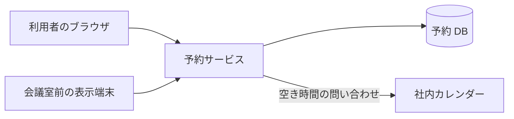
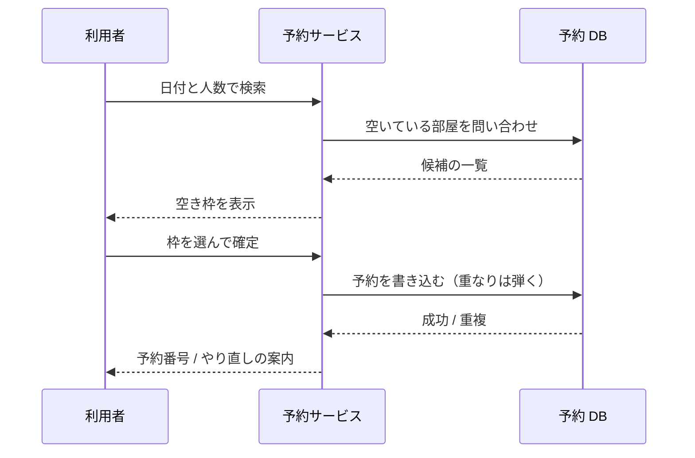
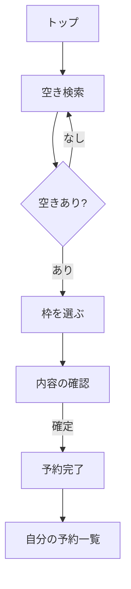

# 1. 何を作るか

## 1.1 いまの困りごと

会議室はホワイトボードの表で押さえている。書いた人しか読めない字があり、
遠隔の拠点からは見えない。二重予約が月に数回起き、そのたびに立ち話で調整している。

## 1.2 やること・やらないこと

| 範囲 | 含む / 含まない |
| --- | --- |
| 会議室の空き確認と予約 | 含む |
| 繰り返し予約（毎週・毎月） | 含む |
| 入退室の記録 | 含まない |
| 備品（プロジェクター等）の貸出 | 含まない（別システム） |
| 社外からの予約 | 含まない |

## 1.3 言葉

| 言葉 | 意味 |
| --- | --- |
| 予約 | ある会議室のある時間帯を 1 人が押さえた状態 |
| 枠 | 予約の最小単位。15 分 |
| 主催者 | 予約を作った人。取り消せるのはこの人だけ |

# 2. 組み立て

## 2.1 全体

## 2.2 予約を取るまで

# 3. 機能

| ID | 機能 | 使う人 | 優先度 |
| --- | --- | --- | --- |
| F-001 | 空き検索 | 全員 | 必須 |
| F-002 | 予約する | 全員 | 必須 |
| F-003 | 予約を取り消す | 主催者 | 必須 |
| F-004 | 繰り返し予約 | 全員 | 推奨 |
| F-005 | 部屋の一覧を管理する | 総務 | 必須 |
| F-006 | 当日の一覧を表示端末に出す | 総務 | 推奨 |

## 3.1 F-002 予約する

枠は 15 分刻み。最短 15 分、最長 4 時間。同じ部屋の同じ枠は 1 件しか取れない。
確定の瞬間に重なりを判定するので、画面に出ていた空きが埋まっていることはありうる。
その場合は「先に取られました」と出して、検索結果を出し直す。

## 3.2 F-003 予約を取り消す

取り消せるのは主催者だけ。開始時刻を過ぎた予約は取り消せない（記録として残す）。
総務は代理で取り消せるが、誰が取り消したかを残す。

# 4. 画面

# 5. 速さと止まらなさ

| 見るところ | 目標 |
| --- | --- |
| 空き検索の応答（95%） | 500 ms 以内 |
| 予約確定の応答（95%） | 800 ms 以内 |
| 同時に使う人 | 200 人 |
| 稼働率 | 平日 8:00〜20:00 は 99.9% |

# 6. 決めたこと

## 6.1 重なりの判定はデータベースに任せる

アプリ側で「検索してから書く」と、その隙間に別の予約が入る。
時間帯そのものに一意の制約を張り、重なったら書き込みが失敗する形にする。

## 6.2 削除しない

取り消した予約も行としては残し、状態で表す。
ホワイトボードでは消された予定を追えず、「誰が消したのか」で揉めていた。

## 6.3 社員の氏名を持たない

予約の持ち主は社員コードで持つ。氏名は人事システムから表示のときだけ引く。
持てば必ず古くなる。
