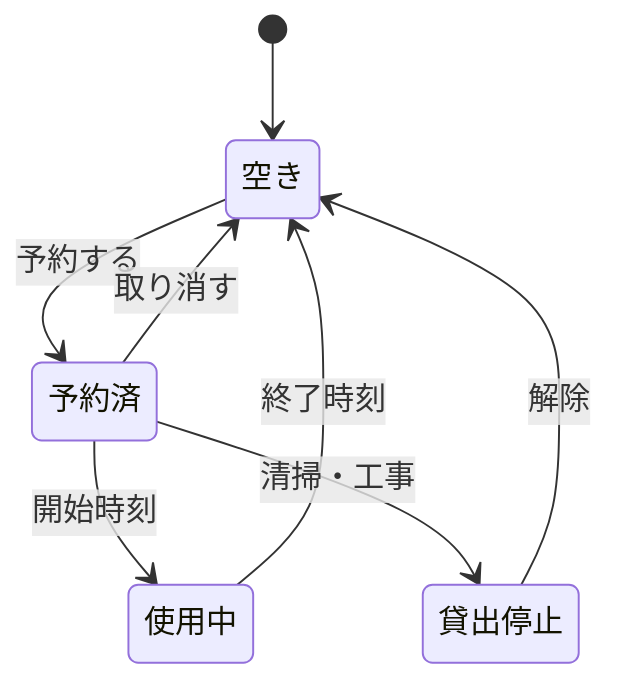
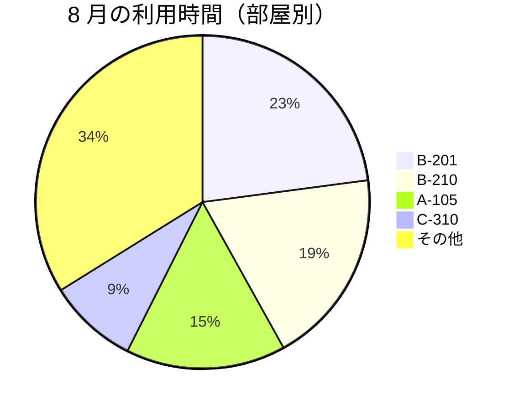
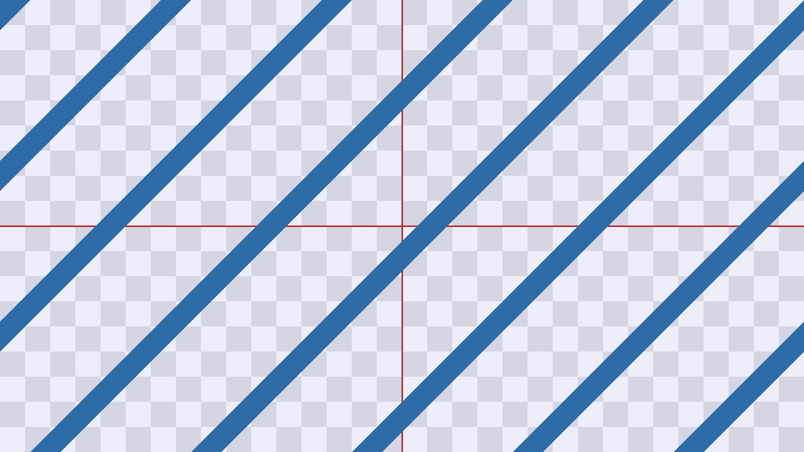

# 自由形式の見本 — 崩れるところが無いかを見る

スキーマの宣言が無い、ただの Markdown です。**見出し・表・コード・画像・図・URL・脚注**を
1 本に詰めてあります。上から下まで一気に転がして、途中で崩れるところが無いかを見てください。

---

## 1. 文字まわり

**太字**、*斜体*、~~打ち消し~~、`インラインのコード`、<kbd>Ctrl</kbd> + <kbd>F</kbd>。

長い段落を 1 つ置いておきます。行の折り返しと行間、それに読点の後ろの詰まり方を見るためのものです。日本語と English が混ざったとき、`code` が混ざったとき、それに 1,234,567 のような数字が混ざったときに、行の高さが揃っているかどうか。ここで揃っていないと、表の中でも揃いません。

> 引用の中に **太字** と `コード` を入れています。
>
> > 引用の中の引用。左の線が二重になるかどうか。

1. 順序ありの一覧
2. 二番目
   - 中に入れ子の一覧
   - もう 1 つ
     1. さらに中
3. 三番目

- [ ] チェックが入っていない項目
- [x] チェックが入っている項目

---

## 2. 長い表

横に長い表です。**画面からはみ出したときにどうなるか**を見ます。

| 部屋 | 階 | 定員 | プロジェクター | ホワイトボード | 電源 | 窓 | 予約単位 | 平日料金 | 休日料金 | 備考 |
| --- | ---: | ---: | :---: | :---: | ---: | :---: | --- | ---: | ---: | --- |
| A-101 | 1 | 4 | ○ | ○ | 4 | あり | 15 分 | 0 | 0 | 立ち会議向け |
| A-102 | 1 | 4 | | ○ | 2 | あり | 15 分 | 0 | 0 | |
| A-105 | 1 | 8 | ○ | ○ | 8 | あり | 15 分 | 0 | 0 | 電話会議の機材あり |
| B-201 | 2 | 12 | ○ | ○ | 12 | あり | 30 分 | 0 | 0 | 部門会議で埋まりやすい |
| B-202 | 2 | 12 | ○ | ○ | 12 | なし | 30 分 | 0 | 0 | 換気が弱い |
| B-210 | 2 | 20 | ○ | ○ | 20 | あり | 30 分 | 0 | 0 | 座席は可動 |
| C-301 | 3 | 2 | | | 2 | なし | 15 分 | 0 | 0 | 面談用。防音 |
| C-302 | 3 | 2 | | | 2 | なし | 15 分 | 0 | 0 | 面談用。防音 |
| C-310 | 3 | 40 | ○ | ○ | 40 | あり | 60 分 | 0 | 12000 | 休日は事前申請 |
| D-401 | 4 | 60 | ○ | ○ | 60 | あり | 60 分 | 0 | 30000 | 研修室。前日までに申請 |

セルを空けているところは、**空のまま**にしています。`—` や `N/A` で埋めません。

---

## 3. コード

```ts
export function overlaps(a: Slot, b: Slot): boolean {
  // 端が触れているだけ（10:00 終わり と 10:00 始まり）は重なりに数えない。
  return a.startsAt < b.endsAt && b.startsAt < a.endsAt;
}
```

```sql
select room_code, count(*) as booked
from reservations r
join rooms m on m.id = r.room_id
where r.status = 'booked'
  and r.starts_at >= date_trunc('month', now())
group by room_code
order by booked desc;
```

```
言語の指定が無いコード。
    字下げがそのまま出るかどうか。
        さらに深く。
```

長い 1 行のコードを置きます。横にはみ出したときに、行ごと切れるか、折り返すか、それとも横に転がせるか。

```sh
pnpm --filter @md-business/desktop tauri dev -- --config '{"build":{"beforeDevCommand":"pnpm --filter @md-business/desktop dev"}}'
```

---

## 4. 図

図が出るまでの間、何も出ないのか、場所だけ取っておくのか。





---

## 5. 画像

同じフォルダの画像を並べています。横長のものと、透過のもの。




SVG も置いています。拡大したときにぼやけないかどうか。


---

## 6. 本文の中の URL

裸で書いた URL: https://example.com/rooms/availability?startsAt=2026-08-20T13:00

リンクにした URL: [空き検索の API](https://example.com/rooms/availability)

同じフォルダの文書へのリンク: [基本設計書](./02-spec.md) / [検証シート（表）](./09-sheet-small.tsv)

存在しないところへのリンク: [ここは無い](./99-nothing.md)

---

## 7. 脚注

会議室の予約は 15 分刻みです[^kizami]。繰り返しの上限は 26 回にしています[^kurikaeshi]。

[^kizami]: 5 分刻みにすると選択肢が増えすぎて、押し間違いが増えました。
[^kurikaeshi]: 半年ぶんです。それより先は部屋の配置が変わることがあるため、取り直してもらいます。

---

## 8. 区切りのあと

ここが最後です。**下端まで転がしたときに、最後の行が隠れていないか**を見てください。
