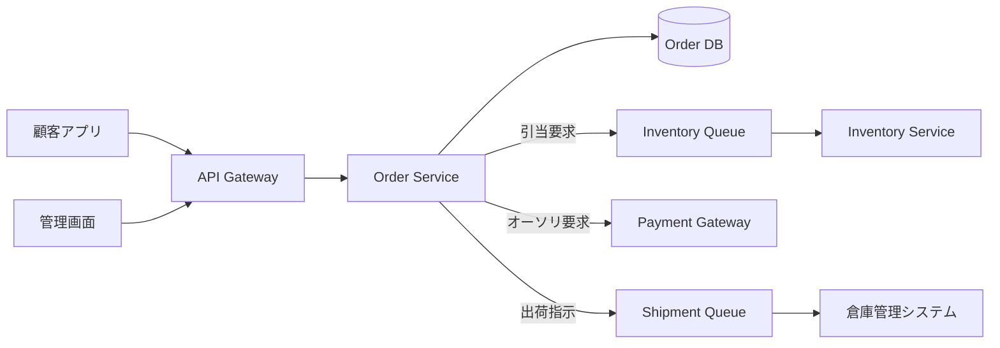
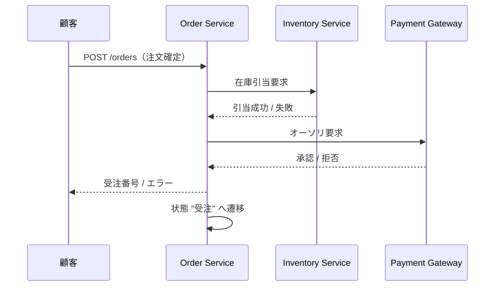
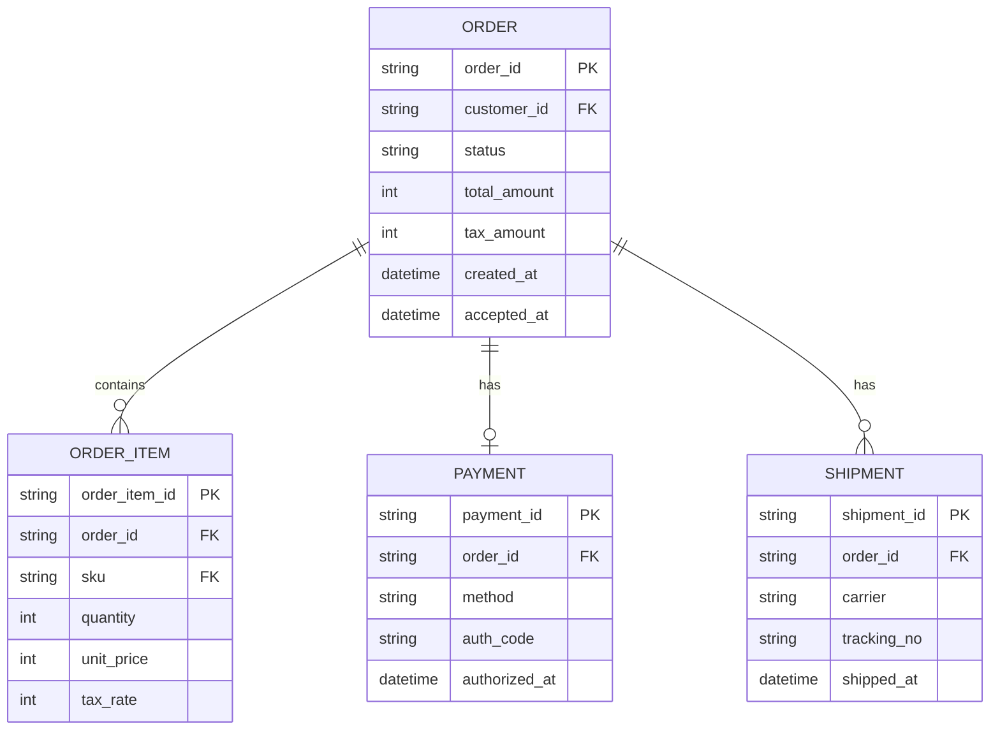
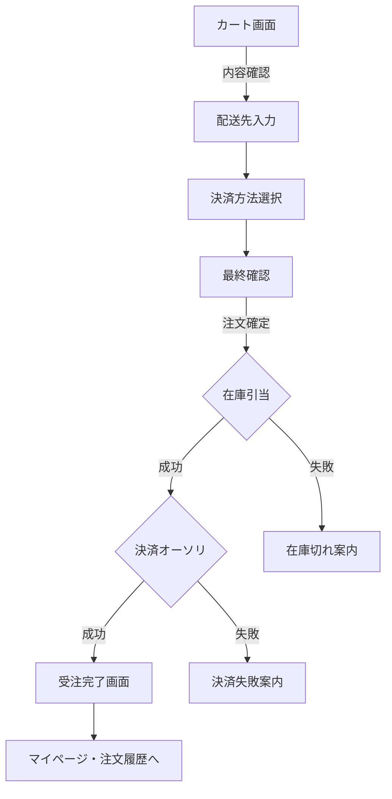

# 1. 概要

## 1.1 背景

当社 EC サイトは年商 12 億円規模で稼働中だが、現行の注文管理は受注・在庫引当・出荷指示の各機能が異なる社内システムに分散しており、運用上の二重入力と数字のズレが業務を圧迫している。本サブシステムはこれらを統合し、注文ライフサイクル全体を 1 つのドメインで一貫管理することを目的とする。

## 1.2 目的

- 注文受領から出荷完了までの状態遷移を単一のドメインモデルで管理する
- 在庫システム・決済システム・配送システムとの I/F を REST API + 非同期イベントで標準化する
- 業務担当者向け管理画面と顧客向け API を同一データソース上で提供する

## 1.3 スコープ

| スコープ | 含む / 含まない |
|---|---|
| 注文の作成・更新・キャンセル | 含む |
| 在庫引当（予約・解放） | 含む |
| 決済処理 | 含まない（既存 PG サービスを利用） |
| 配送ステータス追跡 | 含む（配送会社 API 連携経由） |
| 顧客マイページ UI | 含まない（フロントエンド側の別案件） |

## 1.4 用語

| 用語 | 定義 |
|---|---|
| 注文（Order） | 顧客が確定した購入意思の単位 |
| 受注（Acceptance） | 在庫引当 + 決済オーソリ成功後の状態 |
| 出荷指示（Shipment Order） | 倉庫システムへの出荷リクエスト |
| 引当（Allocation） | 注文行に対する在庫の予約 |

# 2. システム構成

## 2.1 コンポーネント構成

注文管理サブシステムは、API ゲートウェイ配下に Order Service を中核として配置し、外部システムとは非同期メッセージング（Cloud Pub/Sub）で疎結合に連携する。



## 2.2 注文確定シーケンス



# 3. 機能仕様

## 3.1 機能一覧

| ID | 機能名 | 利用者 | 優先度 |
|---|---|---|---|
| F-001 | 注文作成 | 顧客 | 必須 |
| F-002 | 注文照会 | 顧客・業務担当者 | 必須 |
| F-003 | 注文キャンセル | 顧客（受注前まで） | 必須 |
| F-004 | 在庫引当 | システム内部 | 必須 |
| F-005 | 出荷指示 | 業務担当者 | 必須 |
| F-006 | 配送ステータス更新 | 配送会社（Webhook） | 推奨 |
| F-007 | 売上集計レポート | 業務担当者 | 推奨 |

## 3.2 F-001 注文作成

顧客がカート確定操作を行うと、注文行の合計金額・税額・送料が確定し、`Order` エンティティが新規作成される。状態は **作成中** → **引当中** → **受注** → **出荷準備** → **出荷済** → **配送完了** と遷移する。引当または決済が失敗した場合は **キャンセル（自動）** へ遷移し、引当済の在庫を解放する。

## 3.3 F-003 注文キャンセル

注文キャンセルは状態が **受注** までは顧客自身が可能、それ以降は業務担当者の手動操作のみ可能とする。出荷済以降のキャンセルは返品フローへ移行する（本サブシステムのスコープ外）。

# 4. データモデル

## 4.1 ER 図



## 4.2 主要テーブル定義

### `orders`

| カラム | 型 | NULL | 説明 |
|---|---|---|---|
| order_id | VARCHAR(26) | NO | ULID。主キー |
| customer_id | VARCHAR(26) | NO | 顧客 ID（外部キー） |
| status | VARCHAR(20) | NO | 注文状態（enum） |
| total_amount | INT | NO | 税込合計金額 |
| tax_amount | INT | NO | 消費税額 |
| created_at | TIMESTAMP | NO | 作成日時 |
| accepted_at | TIMESTAMP | YES | 受注成立日時 |

### `order_items`

| カラム | 型 | NULL | 説明 |
|---|---|---|---|
| order_item_id | VARCHAR(26) | NO | ULID。主キー |
| order_id | VARCHAR(26) | NO | 注文 ID（外部キー） |
| sku | VARCHAR(32) | NO | 商品 SKU |
| quantity | INT | NO | 数量 |
| unit_price | INT | NO | 税抜単価 |
| tax_rate | TINYINT | NO | 税率（8 / 10） |

# 5. API 仕様

## 5.1 エンドポイント一覧

| メソッド | パス | 概要 | 認証 |
|---|---|---|---|
| POST | /v1/orders | 注文を作成する | 顧客 JWT |
| GET | /v1/orders/{id} | 注文を取得する | 顧客 JWT / 業務担当者 |
| POST | /v1/orders/{id}/cancel | 注文をキャンセルする | 顧客 JWT |
| GET | /v1/orders | 注文一覧（業務担当者向け） | 業務担当者 |
| POST | /v1/orders/{id}/shipments | 出荷指示を作成する | 業務担当者 |
| POST | /v1/webhooks/carrier-events | 配送会社からの状態更新 | 共有シークレット |

## 5.2 POST /v1/orders

注文を新規作成する。リクエストボディは以下のとおり。

```json
{
  "customer_id": "01HX2V3K5N4PQ7R8WZ9TBYE6CM",
  "items": [
    { "sku": "BOOK-001", "quantity": 2 },
    { "sku": "PEN-042", "quantity": 5 }
  ],
  "shipping_address": {
    "postal_code": "150-0001",
    "address1": "東京都渋谷区神宮前1-1"
  }
}
```

レスポンスは作成された注文の表現を返す（HTTP 201）。バリデーションエラー時は 400、在庫不足時は 409 を返す。

# 6. 画面遷移

## 6.1 注文確定フロー（顧客側）



## 6.2 業務担当者画面

業務担当者向けには別途管理コンソールが用意され、注文一覧 → 注文詳細 → 出荷指示作成の 3 階層で遷移する。詳細は別文書「管理画面 UI 仕様書」を参照。

# 7. 非機能要件

## 7.1 性能

| 指標 | 目標値 |
|---|---|
| 注文作成 API のレスポンスタイム（p95） | 800 ms 以内 |
| 注文取得 API のレスポンスタイム（p95） | 200 ms 以内 |
| 同時注文処理スループット | 50 req/sec（ピーク 150 req/sec まで耐える） |

## 7.2 可用性

- 月間稼働率: 99.9%（計画停止を除く）
- 計画停止: 月 1 回・深夜 2 時間以内
- DB は同期レプリカ 1 台 + 非同期レプリカ 1 台で冗長化

## 7.3 拡張性

注文受領レートが現状の 3 倍まで増えても、Order Service 水平スケールと DB の読み取りレプリカ追加で対応可能な設計とする。スキーマレベルでのシャーディングは初期リリースでは行わない。

# 8. セキュリティ

## 8.1 認証

| 利用者 | 認証方式 |
|---|---|
| 顧客 | OAuth 2.0 + JWT（アクセストークン有効期限 60 分） |
| 業務担当者 | SSO（社内 IdP）+ MFA 必須 |
| 外部 Webhook | HMAC-SHA256 署名検証 + IP 許可リスト |

## 8.2 認可

業務担当者の権限は **閲覧のみ / 出荷指示可 / キャンセル可 / 管理者** の 4 ロールに分け、RBAC で制御する。顧客は自身の注文のみ参照・操作可能とする（リソースオーナーチェックを全エンドポイントで実施）。

## 8.3 データ保護

- 個人情報（氏名・住所・電話番号）は AES-256-GCM で暗号化して保存
- カード番号は自社で保持せず、決済 PG が発行するトークンのみを `payments.auth_code` に保存（PCI DSS スコープから外す）
- 監査ログは別アカウントの S3 に WORM ストレージ設定で 7 年保管

## 8.4 セキュリティ運用

脆弱性スキャンは週次の SAST + 月次の DAST を実施し、Critical / High 検出時は 24 時間以内に修正方針を確定する。インシデント対応手順は別文書「セキュリティ運用手順書」を参照。

---

> 本サンプルは md-business v0.2.0 の `schema-spec` で扱う「基本設計書」スキーマの実例です。
> このファイルを Chrome 拡張で開くと、表紙 + 目次 + 8 章本文の PDF が出力されます（v0.2.0 リリース時）。
